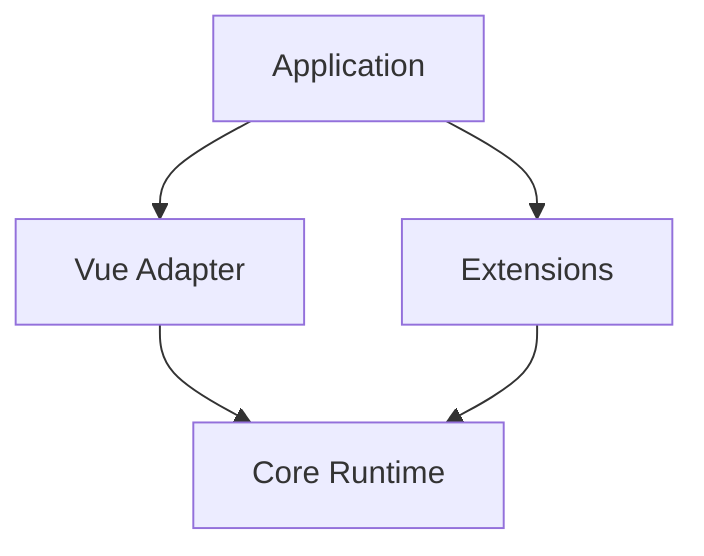
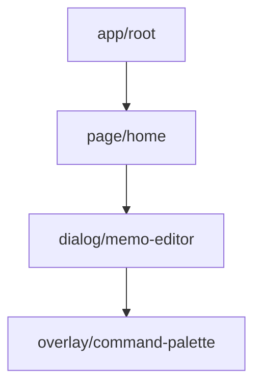
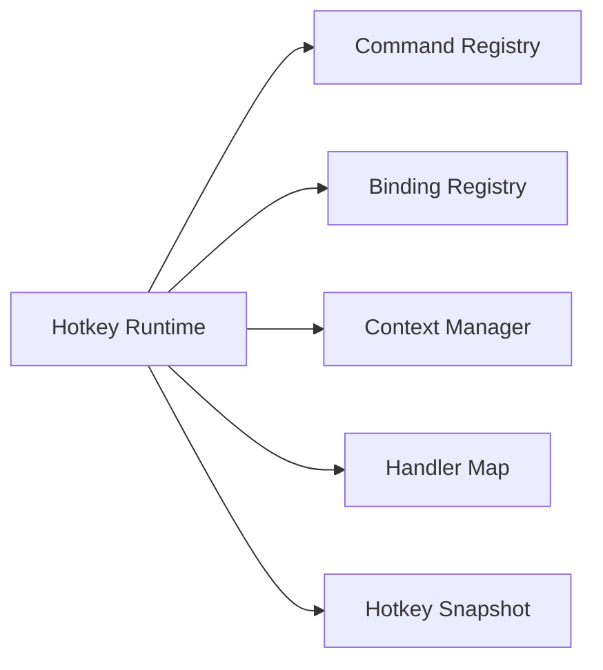
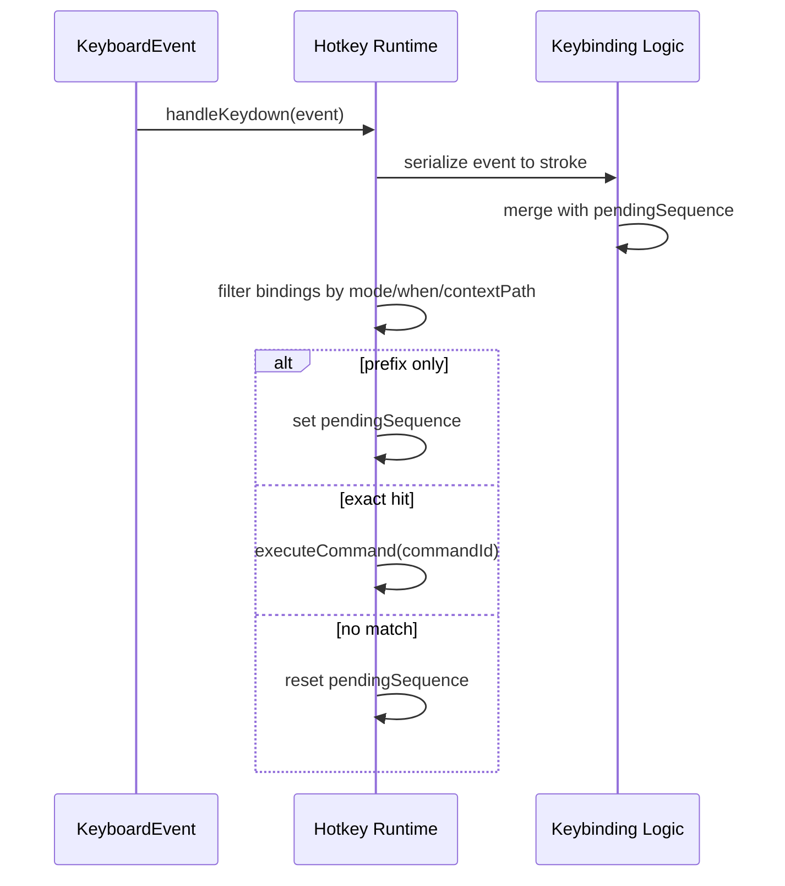
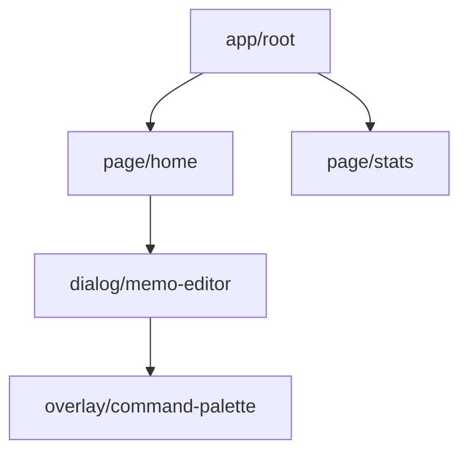

# `@xkit/hotkeys` 设计文档

## 目标

`@xkit/hotkeys` 承载应用级命令、快捷键和上下文运行时。

当前设计解决四件事：

- 静态注册：命令和默认快捷键在应用启动时一次性注册
- 上下文建模：运行时维护一条激活路径，而不是平面 scope
- 输入解析：按 `contextPath + mode + flags` 匹配 binding 并分发命令
- 动态执行：业务组件只注册命令实现，不再参与作用域解析

## 当前模型

当前代码映射：

- `src/core/types.ts`
- `src/core/contextManager.ts`
- `src/core/keybinding.ts`
- `src/core/runtime.ts`
- `src/extensions/commandPalette.ts`
- `src/vue/plugin.ts`

## 核心约束

### 1. 单命令单 handler

每个 `commandId` 在运行时只能注册一个 handler。

这条约束用于降低歧义：

- 不再解析“同一个命令到底由哪个组件执行”
- 不再需要 handler 的 `context matcher`
- 出现重复注册时直接报错

因此：

- `binding` 负责“什么时候触发这个命令”
- `handler` 只负责“这个命令执行什么”

### 2. 业务唯一命名

命令名按业务域收束，而不是做可复用抽象命令。

当前 `daily/web` 采用两类前缀：

- `app.*`
- `home.*`

例如：

- `app.nav.home`
- `app.command_palette.open`
- `home.memo.create`
- `home.editor.close`

### 3. 路径匹配，深层优先

运行时维护一条激活路径：

binding 匹配规则：

1. 只在当前激活路径上做匹配
2. `context` 可以命中路径上的任意节点
3. 命中多个 binding 时，优先选择更深的节点
4. 同深度时再按 `priority`
5. 最后按注册顺序稳定选择

这让 `app/root` 可以承载全局命令，同时更深层 context 仍然能覆盖它。

## 核心对象

### Command

`HotkeyCommandDefinition` 是静态元数据：

- `id`
- `title`
- `category`
- `aliases`
- `visibleWhen(snapshot)`

command 不携带业务逻辑。

### Binding

`HotkeyBindingDefinition` 是静态按键映射：

- `commandId`
- `keys`
- `context`
- `mode`
- `priority`
- `when(snapshot)`

binding 负责输入解释，不负责执行。

### Context

`HotkeyContextNode` 表示激活路径上的一个节点：

- `kind`
- `id`
- `data`

`useCtx()` 负责把组件节点挂入全局 context tree。

### Handler

`HotkeyCommandHandlerDefinition` 只包含：

- `commandId`
- `run`

`useCmd()` 是业务层注册唯一命令实现的入口。

### Snapshot

`HotkeySnapshot` 是运行时事实来源：

- `contextPath`
- `mode`
- `flags`
- `pendingSequence`

## Runtime 结构

运行时职责：

- 注册静态 commands
- 注册静态 bindings
- 注册唯一 handlers
- 维护 snapshot
- 处理 keydown 和 sequence
- 查询当前可执行命令

## Context 规则

### 激活路径选择

context manager 当前规则：

1. 选择最深的活跃路径
2. 深度相同时，选择最近注册的叶子节点

### inactive 节点

路径上任一 inactive 节点都会使整条候选路径失效。

Vue adapter 还做了一层修正：

- 如果某个 context 自身 inactive
- 它不会把自己的 `contextId` 继续提供给后代
- 后代会继承上一个有效父节点

这样 `app/root -> page/home` 不会被 inactive 的中间节点打断。

## 键盘分发

当前 binding 解析顺序：

1. `mode`
2. `when(snapshot)`
3. `contextPath` 匹配
4. sequence 前缀或精确命中
5. `priority`
6. 匹配深度
7. 注册顺序

## Flags 的角色

`flags` 用来表达横切状态，而不是位置层级。

当前 `daily/web` 使用的关键 flag：

- `dialog.open`
- `home.hasSelectedMemo`
- `home.isEditorOpen`
- `isTyping`

典型用法：

- `app/root` 级命令通过 `when: !dialog.open` 避免在 dialog 打开时穿透
- `visibleWhen(home.hasSelectedMemo)` 控制命令面板里是否展示“编辑/删除当前 memo”

## `app/root` 在 `daily/web` 中的作用

`daily/web` 当前上下文树采用：

作用分层：

- `app/root`
  全局命令，如 `app.nav.*`、`app.command_palette.open`
- `page/home`
  Home 页面命令，如 `home.memo.*`
- `dialog/memo-editor`
  编辑器命令，如 `home.editor.*`
- `overlay/command-palette`
  面板自身的输入行为

## Command Palette 为什么放在 extension

core 提供：

- `queryExecutableCommands()`
- `executeCommand()`
- `subscribe()`

command palette 自己还有一层 UI 状态：

- `isOpen`
- `query`
- `activeIndex`

这属于一种可选消费方式，不属于 hotkeys core 本体，所以放在 `extensions`。

## 当前测试覆盖

`@xkit/hotkeys` 当前已覆盖：

- context path 选择和 inactive 语义
- binding 归一化和 sequence
- 单命令单 handler
- 路径匹配与深层优先
- command palette extension
- Vue context 继承修正

`daily/web` 当前已覆盖：

- `app/root` 在非 Home 路由下的 `g h / ctrl+k / dialog.open`
- `home -> editor -> command-palette` 的输入接管关系
- `Esc`、`:`、`Ctrl+K`、`g r` 等核心链路
